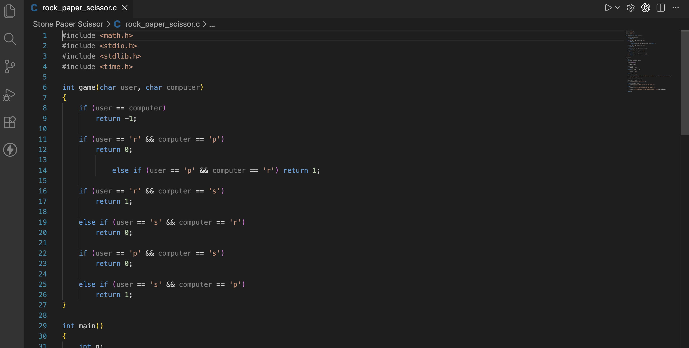
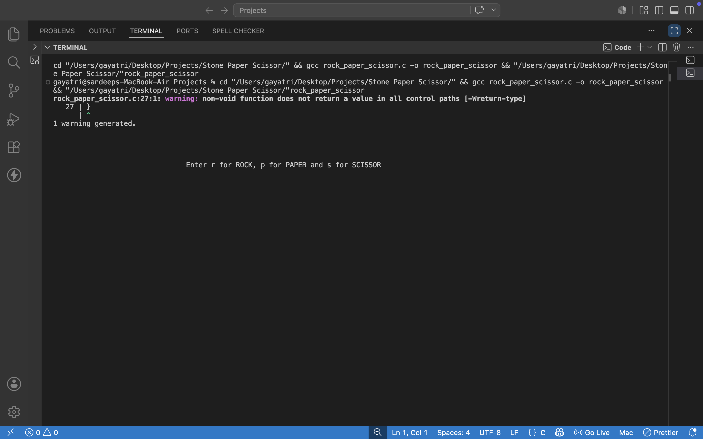
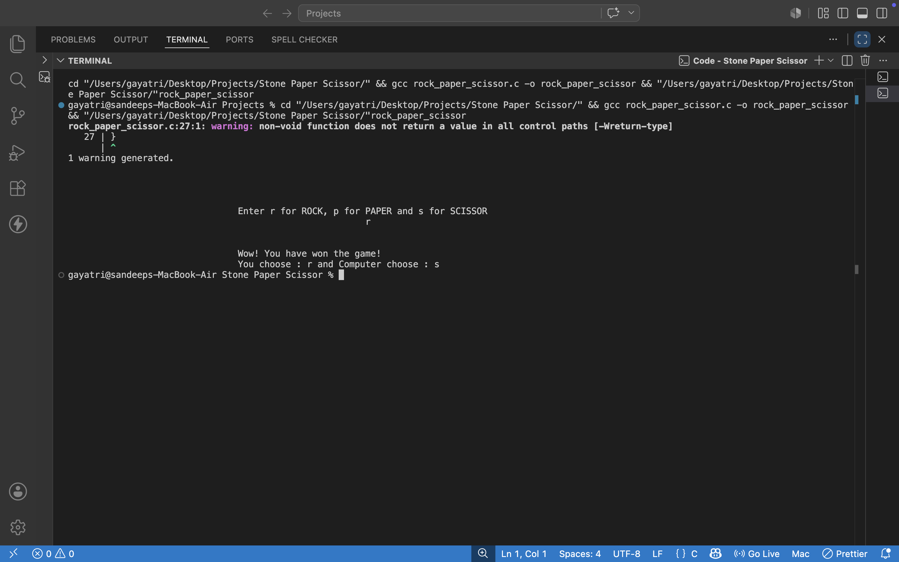

# Rock🪨 Paper📄 Scissors✂️ Game in C

A Simple console-based Rock Paper Scissors game built using C.

## 📍FEATURES:-
- User vs Computer
- Random Computer Choice
- Winner Declaration

## 💡Technology
- C programming

## How to run:-
Compile and run the C file.

# 🚀Live Demo:-
The screenshots below demonstrate the gameplay and functionality of the "Rock-Paper-Scissors" game.
- Start Screen
  
- Gameplay
  
- Result Screen
  
